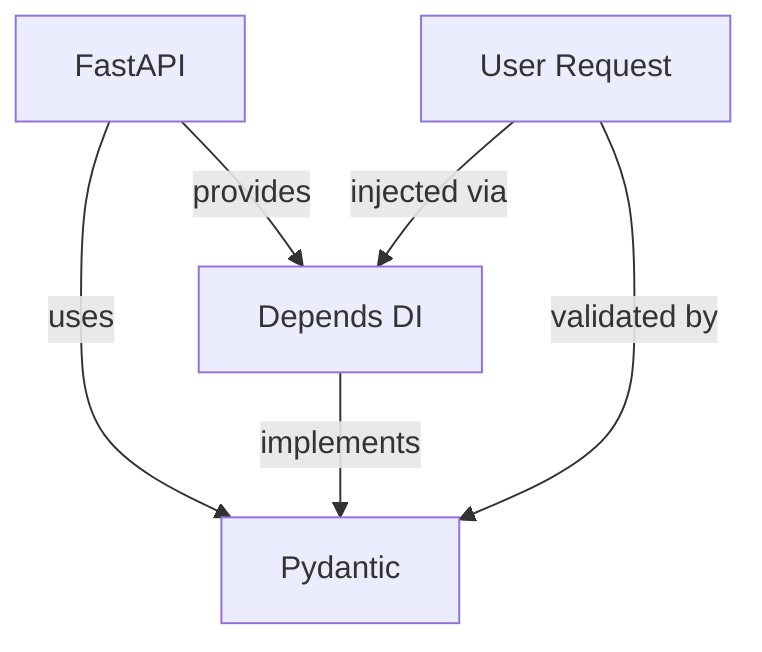

# Memory Graphs Domain - Semantic Translation Examples

## Overview

The **Memory Graphs** domain encompasses knowledge graph structures, memory systems, vector embeddings, and retrieval mechanisms used in AI systems and knowledge management. This domain deals with how information is stored, connected, and retrieved in graph-based memory architectures.

**Core Concepts:**
- **Memory Types:** Episodic (events/experiences), Semantic (facts/concepts), Procedural (skills/processes)
- **Graph Structures:** Knowledge graphs (entities + relationships), Memory networks, Conceptual hierarchies
- **Vector Operations:** Embeddings (dense representations), Similarity search, Clustering
- **Retrieval Patterns:** Semantic search (meaning-based), Graph traversal (relationship-based), Hybrid (combined)

**Common Ambiguities:**
- "memory" could mean: knowledge graph, vector database, episodic memory, semantic memory, or system RAM
- "graph" could mean: knowledge graph structure, visualization diagram, or dependency graph
- "embedding" could mean: vector embedding (representation) or embedding layer (neural network)
- "retrieval" could mean: semantic search, graph traversal, hybrid retrieval, or SQL queries
- "node" could mean: graph node (entity), memory node (experience), or network node (infrastructure)

---

## Example 1: "add this to memory"

### User Request
"I need to add this conversation to memory so we can reference it later"

### Ambiguity Detected
**Ambiguous term:** "memory"

**Possible interpretations:**
1. **Knowledge graph** - Store as structured entities and relationships
2. **Vector memory** - Store as embedded chunks in vector database
3. **Episodic memory** - Store as timestamped experience/event
4. **Semantic memory** - Extract facts and add to concept hierarchy
5. **System RAM** - Technical memory storage (likely not intended)

### Semantic Validation Process

**Memory Graphs provides different memory types for different use cases:**

1. **Knowledge Graph Storage** - Structured entities + relationships
   - Use when: Need to query connections between concepts
   - Structure: Nodes (entities) + Edges (relationships)
   - Example: Person → WorksAt → Company

2. **Vector Memory Storage** - Embedded semantic chunks
   - Use when: Need similarity-based retrieval
   - Structure: Text chunks → Embeddings → Vector DB
   - Example: Store conversation snippets for semantic search

3. **Episodic Memory** - Timestamped experiences
   - Use when: Need chronological event tracking
   - Structure: Event + Context + Timestamp
   - Example: "2024-11-18: User discussed API design"

4. **Semantic Memory** - Extracted facts/concepts
   - Use when: Building knowledge base of truths
   - Structure: Fact + Source + Confidence
   - Example: "FastAPI uses Pydantic for validation"

### User Clarifies
"I want to be able to search for similar conversations later based on topic"

### Validated Translation

**Storage approach:** Vector memory with semantic search

```python
from langchain.embeddings import OpenAIEmbeddings
from langchain.vectorstores import Chroma
from langchain.text_splitter import RecursiveCharacterTextSplitter

# Split conversation into semantic chunks
text_splitter = RecursiveCharacterTextSplitter(
    chunk_size=1000,
    chunk_overlap=200
)
chunks = text_splitter.split_text(conversation_text)

# Generate embeddings
embeddings = OpenAIEmbeddings()

# Store in vector database
vectorstore = Chroma.from_texts(
    texts=chunks,
    embedding=embeddings,
    metadatas=[
        {"timestamp": "2024-11-18", "topic": "semantic-linguist", "type": "conversation"}
        for _ in chunks
    ],
    collection_name="conversations"
)

# Later: Semantic search for similar conversations
query = "How did we handle domain ambiguities?"
similar_conversations = vectorstore.similarity_search(
    query=query,
    k=5  # Top 5 most similar
)
```

**Why this approach:**
- Vector embeddings capture semantic meaning
- Similarity search finds topically related conversations
- Metadata enables filtering by date/topic
- No need for exact keyword matching

---

## Example 2: "create a knowledge graph"

### User Request
"Can you create a knowledge graph showing the relationships between these concepts?"

### Ambiguity Detected
**Ambiguous term:** "knowledge graph"

**Possible interpretations:**
1. **Structured graph database** - Neo4j-style property graph with nodes + edges
2. **Visualization diagram** - GraphViz/Mermaid visual representation
3. **RDF triple store** - Semantic web standard (subject-predicate-object)
4. **In-memory graph structure** - Python networkx or similar
5. **Conceptual map** - Simple text-based relationship description

### Semantic Validation Process

**Different "knowledge graph" implementations:**

**1. Graph Database (Neo4j):**
```cypher
// Create nodes and relationships
CREATE (fastapi:Framework {name: 'FastAPI', type: 'web'})
CREATE (pydantic:Library {name: 'Pydantic', type: 'validation'})
CREATE (depends:Feature {name: 'Depends()', type: 'DI'})
CREATE (fastapi)-[:USES]->(pydantic)
CREATE (fastapi)-[:PROVIDES]->(depends)
CREATE (depends)-[:IMPLEMENTS]->(pydantic)

// Query relationships
MATCH (f:Framework)-[:USES]->(lib)
WHERE f.name = 'FastAPI'
RETURN lib.name
```

**2. Visualization Diagram (Mermaid):**


**3. In-Memory Graph (NetworkX):**
```python
import networkx as nx

G = nx.DiGraph()
G.add_edge("FastAPI", "Pydantic", relationship="uses")
G.add_edge("FastAPI", "Depends()", relationship="provides")
G.add_edge("Depends()", "Pydantic", relationship="implements")

# Traverse relationships
dependencies = list(G.successors("FastAPI"))
# ['Pydantic', 'Depends()']
```

**4. RDF Triple Store:**
```turtle
@prefix ex: <http://example.org/> .

ex:FastAPI rdf:type ex:Framework .
ex:FastAPI ex:uses ex:Pydantic .
ex:FastAPI ex:provides ex:DependsFeature .
ex:DependsFeature ex:implements ex:Pydantic .
```

### User Clarifies
"I need to visualize it for documentation, and also query relationships programmatically"

### Validated Translation

**Implementation:** Neo4j graph database + Cypher queries + GraphViz export for visualization

```python
from neo4j import GraphDatabase
import graphviz

class KnowledgeGraph:
    def __init__(self, uri, user, password):
        self.driver = GraphDatabase.driver(uri, auth=(user, password))

    def add_concept(self, name, properties):
        """Add node to knowledge graph"""
        with self.driver.session() as session:
            session.run(
                "CREATE (n:Concept {name: $name, properties: $props})",
                name=name, props=properties
            )

    def add_relationship(self, from_concept, to_concept, relationship_type):
        """Add edge between nodes"""
        with self.driver.session() as session:
            session.run(
                """
                MATCH (a:Concept {name: $from})
                MATCH (b:Concept {name: $to})
                CREATE (a)-[r:RELATES {type: $rel_type}]->(b)
                """,
                from=from_concept, to=to_concept, rel_type=relationship_type
            )

    def query_relationships(self, concept):
        """Find all relationships for a concept"""
        with self.driver.session() as session:
            result = session.run(
                """
                MATCH (c:Concept {name: $name})-[r]->(related)
                RETURN related.name AS concept, r.type AS relationship
                """,
                name=concept
            )
            return [(record["concept"], record["relationship"]) for record in result]

    def export_visualization(self, output_path):
        """Export graph as GraphViz diagram"""
        dot = graphviz.Digraph(comment='Knowledge Graph')

        with self.driver.session() as session:
            # Get all nodes
            nodes = session.run("MATCH (n:Concept) RETURN n.name AS name")
            for record in nodes:
                dot.node(record["name"])

            # Get all relationships
            edges = session.run(
                "MATCH (a)-[r]->(b) RETURN a.name AS from, b.name AS to, r.type AS rel"
            )
            for record in edges:
                dot.edge(record["from"], record["to"], label=record["rel"])

        dot.render(output_path, format='png')

# Usage
kg = KnowledgeGraph("bolt://localhost:7687", "neo4j", "password")

# Add concepts
kg.add_concept("FastAPI", {"type": "framework", "language": "python"})
kg.add_concept("Pydantic", {"type": "library", "purpose": "validation"})

# Add relationships
kg.add_relationship("FastAPI", "Pydantic", "uses")

# Query programmatically
relationships = kg.query_relationships("FastAPI")
# [("Pydantic", "uses")]

# Export visualization for docs
kg.export_visualization("knowledge_graph")
```

**ASCII representation of resulting graph:**
```
┌─────────┐
│ FastAPI │
└────┬────┘
     │ uses
     ▼
┌──────────┐      implements      ┌────────────┐
│ Pydantic │◄─────────────────────│ Depends()  │
└──────────┘                      └─────▲──────┘
     ▲                                  │
     │ validates                   provides
     │                                  │
┌────┴─────────┐                  ┌────┴────┐
│ User Request │                  │ FastAPI │
└──────────────┘                  └─────────┘
```

---

## Example 3: "use embeddings for retrieval"

### User Request
"I want to use embeddings for retrieval in my application"

### Ambiguity Detected
**Ambiguous terms:** "embeddings" and "retrieval"

**Possible interpretations for "embeddings":**
1. **Vector embeddings** - Dense numerical representations (OpenAI, sentence-transformers)
2. **Embedding layer** - Neural network layer that learns representations
3. **Graph embeddings** - Node2vec, DeepWalk for graph nodes
4. **Word embeddings** - Word2Vec, GloVe for individual words

**Possible interpretations for "retrieval":**
1. **Semantic search** - Similarity-based vector search
2. **Graph traversal** - Following edges in knowledge graph
3. **Hybrid retrieval** - Combining semantic + keyword + graph
4. **SQL queries** - Traditional database lookup

### Semantic Validation Process

**Embedding types comparison:**

| Type | Use Case | Example | Output |
|------|----------|---------|--------|
| **Vector embeddings** | Semantic similarity | "FastAPI dependency injection" | 1536-dim vector |
| **Embedding layer** | Model training | First layer of neural network | Learned weights |
| **Graph embeddings** | Node similarity | Embed "FastAPI" node in graph | 128-dim vector |
| **Word embeddings** | NLP tasks | "dependency" → vector | 300-dim vector |

**Retrieval patterns comparison:**

**1. Semantic Search (Vector Similarity):**
```python
from sentence_transformers import SentenceTransformer
import faiss
import numpy as np

# Generate embeddings
model = SentenceTransformer('all-MiniLM-L6-v2')
documents = ["FastAPI uses Pydantic", "Django uses ORM", "Flask is lightweight"]
doc_embeddings = model.encode(documents)

# Build FAISS index
index = faiss.IndexFlatL2(doc_embeddings.shape[1])
index.add(np.array(doc_embeddings).astype('float32'))

# Query
query = "What framework uses Pydantic?"
query_embedding = model.encode([query])
distances, indices = index.search(query_embedding.astype('float32'), k=1)

print(documents[indices[0][0]])  # "FastAPI uses Pydantic"
```

**2. Graph Traversal:**
```cypher
// Find concepts related to FastAPI through 2 hops
MATCH path = (start:Concept {name: 'FastAPI'})-[*1..2]-(related)
RETURN related.name, length(path)
ORDER BY length(path)
```

**3. Hybrid Retrieval (Semantic + Graph):**
```python
def hybrid_retrieval(query, k=5):
    # Step 1: Semantic search for candidates
    semantic_results = vector_search(query, k=20)

    # Step 2: Graph traversal for connected concepts
    graph_results = []
    for result in semantic_results:
        connected = graph.get_neighbors(result.entity, max_depth=2)
        graph_results.extend(connected)

    # Step 3: Re-rank by combined score
    combined = []
    for entity in set(semantic_results + graph_results):
        semantic_score = get_semantic_score(query, entity)
        graph_score = get_graph_centrality(entity)
        combined_score = 0.7 * semantic_score + 0.3 * graph_score
        combined.append((entity, combined_score))

    # Return top-k
    return sorted(combined, key=lambda x: x[1], reverse=True)[:k]
```

### User Clarifies
"I need to find documents similar to a user's question, but also want to use the knowledge graph to expand the search to related concepts"

### Validated Translation

**Implementation:** Hybrid retrieval combining vector embeddings + knowledge graph traversal

```python
from langchain.embeddings import OpenAIEmbeddings
from langchain.vectorstores import Chroma
from neo4j import GraphDatabase
import numpy as np

class HybridRetriever:
    def __init__(self, vector_db, graph_db):
        self.vector_db = vector_db
        self.graph_db = graph_db
        self.embeddings = OpenAIEmbeddings()

    def retrieve(self, query, k=5, expansion_depth=1):
        """
        Hybrid retrieval: semantic search + graph expansion

        Args:
            query: User question
            k: Number of final results
            expansion_depth: How many graph hops to expand
        """
        # Step 1: Semantic search for initial candidates
        semantic_results = self.vector_db.similarity_search_with_score(
            query=query,
            k=k * 2  # Get more candidates for expansion
        )

        # Step 2: Extract entities from semantic results
        entities = self._extract_entities(semantic_results)

        # Step 3: Graph expansion - find related concepts
        expanded_entities = set(entities)
        with self.graph_db.session() as session:
            for entity in entities:
                # Find concepts within expansion_depth hops
                result = session.run(
                    """
                    MATCH path = (start:Concept {name: $entity})-[*1..$depth]-(related)
                    RETURN DISTINCT related.name AS concept,
                           length(path) AS distance
                    ORDER BY distance
                    """,
                    entity=entity,
                    depth=expansion_depth
                )
                for record in result:
                    expanded_entities.add(record["concept"])

        # Step 4: Re-rank all documents mentioning expanded entities
        all_candidates = []
        for entity in expanded_entities:
            # Find documents containing this entity
            entity_docs = self.vector_db.similarity_search(
                query=entity,
                k=5
            )
            all_candidates.extend(entity_docs)

        # Step 5: Compute hybrid score
        scored_docs = []
        for doc in all_candidates:
            # Semantic similarity score
            doc_embedding = self.embeddings.embed_query(doc.page_content)
            query_embedding = self.embeddings.embed_query(query)
            semantic_score = np.dot(doc_embedding, query_embedding)

            # Graph centrality score (how connected is this document's entities?)
            graph_score = self._get_graph_score(doc, expanded_entities)

            # Combined score (70% semantic, 30% graph)
            combined_score = 0.7 * semantic_score + 0.3 * graph_score

            scored_docs.append((doc, combined_score))

        # Step 6: Return top-k unique documents
        scored_docs.sort(key=lambda x: x[1], reverse=True)
        unique_docs = []
        seen_content = set()
        for doc, score in scored_docs:
            if doc.page_content not in seen_content:
                unique_docs.append((doc, score))
                seen_content.add(doc.page_content)
            if len(unique_docs) >= k:
                break

        return unique_docs

    def _extract_entities(self, semantic_results):
        """Extract named entities from semantic search results"""
        entities = []
        for doc, score in semantic_results:
            # Simple entity extraction (could use NER model)
            doc_entities = doc.metadata.get("entities", [])
            entities.extend(doc_entities)
        return list(set(entities))

    def _get_graph_score(self, doc, expanded_entities):
        """Score document based on graph connectivity"""
        doc_entities = set(doc.metadata.get("entities", []))
        overlap = len(doc_entities.intersection(expanded_entities))
        return overlap / len(expanded_entities) if expanded_entities else 0

# Usage
retriever = HybridRetriever(
    vector_db=chroma_db,
    graph_db=neo4j_driver
)

query = "How does FastAPI handle dependency injection?"
results = retriever.retrieve(
    query=query,
    k=5,
    expansion_depth=2  # Expand 2 hops in graph
)

for doc, score in results:
    print(f"Score: {score:.3f}")
    print(f"Content: {doc.page_content[:200]}...")
    print(f"Entities: {doc.metadata.get('entities', [])}\n")
```

**How it works:**
1. **Semantic search** finds topically similar documents (vector similarity)
2. **Graph expansion** discovers related concepts (Depends() → Pydantic → validation)
3. **Hybrid scoring** combines both signals (70% semantic, 30% graph connectivity)
4. **Re-ranking** produces final results using both meaning and relationships

---

## Example 4: "store this in a graph node"

### User Request
"Can you store this user profile information in a graph node?"

### Ambiguity Detected
**Ambiguous term:** "graph node"

**Possible interpretations:**
1. **Knowledge graph node** - Entity in knowledge graph (Neo4j, property graph)
2. **Memory node** - Episodic memory entry with timestamp/context
3. **Compute node** - Server/machine in distributed system
4. **Neural network node** - Neuron/unit in neural network
5. **Data structure node** - Node in tree/linked list

### Semantic Validation Process

**Different node types in Memory Graphs context:**

**1. Knowledge Graph Node (Entity):**
```python
# Neo4j property graph node
CREATE (user:Person {
    id: "user123",
    name: "Alice",
    email: "alice@example.com",
    role: "developer"
})
```

**2. Memory Node (Experience):**
```python
# Episodic memory entry
{
    "id": "memory_20241118_001",
    "type": "episodic",
    "timestamp": "2024-11-18T14:30:00Z",
    "event": "User created account",
    "entities": ["Alice", "signup_flow"],
    "context": {
        "source": "web_app",
        "session_id": "sess_abc123"
    },
    "content": "User Alice (alice@example.com) completed signup process"
}
```

**3. Semantic Concept Node:**
```python
# Conceptual knowledge node
{
    "concept": "User",
    "type": "semantic",
    "properties": {
        "definition": "Person who interacts with the system",
        "attributes": ["id", "name", "email", "role"],
        "relationships": ["belongs_to_organization", "has_permissions"]
    },
    "learned_from": ["documentation", "user_stories"],
    "confidence": 0.95
}
```

**ASCII representation of different node types:**

```
Knowledge Graph Node:           Memory Node:                  Concept Node:
┌──────────────────┐          ┌──────────────────┐         ┌──────────────────┐
│   Person: Alice  │          │  Event Memory    │         │  Concept: User   │
├──────────────────┤          ├──────────────────┤         ├──────────────────┤
│ id: user123      │          │ timestamp: 14:30 │         │ type: semantic   │
│ email: alice@... │          │ action: signup   │         │ definition: ...  │
│ role: developer  │──┐       │ context: web_app │         │ attributes: []   │
└──────────────────┘  │       └──────────────────┘         └──────────────────┘
        │             │
        │ BELONGS_TO  │
        ▼             │
┌──────────────────┐  │
│  Org: Acme Inc   │  │
└──────────────────┘  │
                      │
        ┌─────────────┘
        │ HAS_PERMISSION
        ▼
┌──────────────────┐
│  Role: Developer │
└──────────────────┘
```

### User Clarifies
"I want to store the user as an entity in our knowledge graph, and link them to their organization and permissions"

### Validated Translation

**Implementation:** Knowledge graph with entity nodes and relationship edges

```python
from neo4j import GraphDatabase

class UserKnowledgeGraph:
    def __init__(self, uri, user, password):
        self.driver = GraphDatabase.driver(uri, auth=(user, password))

    def create_user_node(self, user_data):
        """Create user entity node with properties"""
        with self.driver.session() as session:
            result = session.run(
                """
                MERGE (u:Person {id: $id})
                SET u.name = $name,
                    u.email = $email,
                    u.role = $role,
                    u.created_at = datetime()
                RETURN u
                """,
                id=user_data["id"],
                name=user_data["name"],
                email=user_data["email"],
                role=user_data["role"]
            )
            return result.single()["u"]

    def link_user_to_organization(self, user_id, org_id):
        """Create relationship: User -[BELONGS_TO]-> Organization"""
        with self.driver.session() as session:
            session.run(
                """
                MATCH (u:Person {id: $user_id})
                MATCH (o:Organization {id: $org_id})
                MERGE (u)-[r:BELONGS_TO {since: datetime()}]->(o)
                RETURN r
                """,
                user_id=user_id,
                org_id=org_id
            )

    def assign_permissions(self, user_id, permissions):
        """Create relationships: User -[HAS_PERMISSION]-> Permission"""
        with self.driver.session() as session:
            for permission in permissions:
                session.run(
                    """
                    MATCH (u:Person {id: $user_id})
                    MERGE (p:Permission {name: $permission})
                    MERGE (u)-[r:HAS_PERMISSION {granted_at: datetime()}]->(p)
                    """,
                    user_id=user_id,
                    permission=permission
                )

    def get_user_graph(self, user_id):
        """Retrieve user node with all relationships"""
        with self.driver.session() as session:
            result = session.run(
                """
                MATCH (u:Person {id: $user_id})
                OPTIONAL MATCH (u)-[r1:BELONGS_TO]->(o:Organization)
                OPTIONAL MATCH (u)-[r2:HAS_PERMISSION]->(p:Permission)
                RETURN u,
                       collect(DISTINCT {org: o.name, since: r1.since}) AS organizations,
                       collect(DISTINCT {permission: p.name, granted: r2.granted_at}) AS permissions
                """,
                user_id=user_id
            )
            return result.single()

# Usage
kg = UserKnowledgeGraph("bolt://localhost:7687", "neo4j", "password")

# Create user node
user_data = {
    "id": "user123",
    "name": "Alice",
    "email": "alice@example.com",
    "role": "developer"
}
user_node = kg.create_user_node(user_data)

# Link to organization
kg.link_user_to_organization("user123", "org_acme")

# Assign permissions
permissions = ["read_code", "write_code", "deploy_staging"]
kg.assign_permissions("user123", permissions)

# Retrieve full user graph
user_graph = kg.get_user_graph("user123")
print(f"User: {user_graph['u']['name']}")
print(f"Organizations: {user_graph['organizations']}")
print(f"Permissions: {user_graph['permissions']}")
```

**Resulting knowledge graph structure:**
```
     ┌─────────────────────┐
     │  Person: Alice      │
     │  id: user123        │
     │  role: developer    │
     └──────────┬──────────┘
                │
    ┌───────────┴───────────┐
    │                       │
    │ BELONGS_TO            │ HAS_PERMISSION
    ▼                       ▼
┌─────────────┐      ┌────────────────┐
│ Org: Acme   │      │ read_code      │
└─────────────┘      ├────────────────┤
                     │ write_code     │
                     ├────────────────┤
                     │ deploy_staging │
                     └────────────────┘
```

---

## Example 5: "improve memory retrieval performance"

### User Request
"Our memory retrieval is too slow, how can we improve performance?"

### Ambiguity Detected
**Ambiguous context:** "memory retrieval" could involve multiple performance bottlenecks

**Possible bottlenecks:**
1. **Vector search performance** - Slow similarity search in high-dimensional space
2. **Graph traversal performance** - Slow Neo4j queries with deep path searches
3. **Embedding generation** - Slow model inference for query encoding
4. **Index efficiency** - Missing or poorly configured database indexes
5. **Network latency** - Slow database connection or data transfer

### Semantic Validation Process

**Performance optimization strategies by bottleneck:**

**1. Vector Search Optimization:**

Slow approach (Exact search):
```python
# Brute-force cosine similarity - O(n*d) for n documents, d dimensions
def slow_search(query_embedding, all_embeddings):
    similarities = []
    for doc_embedding in all_embeddings:
        sim = cosine_similarity(query_embedding, doc_embedding)
        similarities.append(sim)
    return np.argsort(similarities)[-5:]  # Top 5
```

Fast approach (Approximate Nearest Neighbors):
```python
import faiss

# Build HNSW index - O(log n) search time
dimension = 1536  # OpenAI embedding dimension
index = faiss.IndexHNSWFlat(dimension, 32)  # 32 = M parameter

# Add vectors
index.add(all_embeddings.astype('float32'))

# Fast search
distances, indices = index.search(query_embedding, k=5)
```

**2. Graph Traversal Optimization:**

Slow query (No index, variable-length path):
```cypher
// Slow: Explores all paths up to 5 hops
MATCH path = (start:Person {id: 'user123'})-[*1..5]-(related)
RETURN related
```

Fast query (Indexed lookup, limited depth):
```cypher
// Fast: Index on id, limited to 2 hops
CREATE INDEX person_id FOR (p:Person) ON (p.id)

MATCH path = (start:Person {id: 'user123'})-[*1..2]-(related)
WHERE related:Person OR related:Organization
RETURN related
LIMIT 20
```

**3. Embedding Caching:**

Slow (Re-encode every query):
```python
def search(query_text):
    query_embedding = model.encode([query_text])  # Slow: 50-100ms
    results = index.search(query_embedding, k=5)
    return results
```

Fast (Cache frequent queries):
```python
from functools import lru_cache

@lru_cache(maxsize=1000)
def get_cached_embedding(query_text):
    return model.encode([query_text])

def search(query_text):
    query_embedding = get_cached_embedding(query_text)  # Fast: cache hit ~0.1ms
    results = index.search(query_embedding, k=5)
    return results
```

**4. Batch Processing:**

Slow (Sequential):
```python
# Process one query at a time
for query in queries:
    embedding = model.encode([query])  # Multiple model calls
    results = search(embedding)
```

Fast (Batched):
```python
# Batch encode all queries at once
embeddings = model.encode(queries)  # Single batched model call
results = [search(emb) for emb in embeddings]
```

### User Clarifies
"We're using FAISS for vector search, but the searches are taking 200-300ms for our 1M document collection. We need to get this under 50ms."

### Validated Translation

**Implementation:** Optimized FAISS index with GPU acceleration and quantization

```python
import faiss
import numpy as np

class OptimizedVectorRetriever:
    def __init__(self, dimension=1536, use_gpu=True):
        self.dimension = dimension
        self.use_gpu = use_gpu and faiss.get_num_gpus() > 0

        # Build optimized index
        self.index = self._build_index()

    def _build_index(self):
        """
        Build optimized FAISS index for fast retrieval

        Performance targets:
        - <50ms search time for 1M vectors
        - <10GB memory usage
        - >90% recall@10
        """
        # Step 1: Use IVF (Inverted File Index) for fast search
        # Divide space into n_clusters cells, search only relevant cells
        n_clusters = 1024  # sqrt(1M) = 1000, round up to 1024

        # Step 2: Use Product Quantization to compress vectors
        # Reduces memory 8x with minimal accuracy loss
        m = 8  # Split vector into 8 sub-vectors
        bits = 8  # 8 bits per sub-vector

        # Build index: IVF1024 + PQ8
        quantizer = faiss.IndexFlatL2(self.dimension)
        index = faiss.IndexIVFPQ(
            quantizer,
            self.dimension,
            n_clusters,  # Number of cells
            m,           # Number of sub-vectors
            bits         # Bits per sub-vector
        )

        # Step 3: Move to GPU if available (10x speedup)
        if self.use_gpu:
            res = faiss.StandardGpuResources()
            index = faiss.index_cpu_to_gpu(res, 0, index)

        return index

    def train_and_add(self, embeddings):
        """Train index and add vectors"""
        embeddings = embeddings.astype('float32')

        # IVF indexes need training on representative sample
        training_sample = embeddings[:100000]  # Use 100k for training
        self.index.train(training_sample)

        # Add all vectors
        self.index.add(embeddings)

        print(f"Index trained and populated with {self.index.ntotal} vectors")

    def search(self, query_embedding, k=5, nprobe=8):
        """
        Fast search with tunable accuracy/speed tradeoff

        Args:
            query_embedding: Query vector
            k: Number of results
            nprobe: Number of cells to search (higher = more accurate but slower)
                   Default 8 gives good balance
                   Use 1 for fastest (~20ms), 32 for most accurate (~80ms)
        """
        # Set number of cells to search
        self.index.nprobe = nprobe

        # Search
        query_embedding = query_embedding.astype('float32')
        distances, indices = self.index.search(query_embedding, k)

        return distances, indices

    def benchmark(self, test_queries, ground_truth_indices):
        """Benchmark search performance"""
        import time

        times = []
        recalls = []

        for nprobe in [1, 2, 4, 8, 16, 32]:
            self.index.nprobe = nprobe

            start = time.time()
            for query in test_queries:
                _, indices = self.search(query, k=10, nprobe=nprobe)
            elapsed = (time.time() - start) / len(test_queries) * 1000  # ms per query

            # Calculate recall@10
            recall = np.mean([
                len(set(pred[:10]) & set(true[:10])) / 10
                for pred, true in zip(indices, ground_truth_indices)
            ])

            times.append(elapsed)
            recalls.append(recall)

            print(f"nprobe={nprobe:2d}: {elapsed:5.1f}ms, recall@10={recall:.3f}")

        return times, recalls

# Usage
retriever = OptimizedVectorRetriever(dimension=1536, use_gpu=True)

# Load 1M embeddings
embeddings = np.random.randn(1_000_000, 1536).astype('float32')  # Replace with actual embeddings

# Train and populate index
retriever.train_and_add(embeddings)

# Fast search (<50ms with nprobe=8)
query = np.random.randn(1, 1536).astype('float32')
distances, indices = retriever.search(query, k=5, nprobe=8)

print(f"Top 5 results: {indices[0]}")
print(f"Distances: {distances[0]}")

# Benchmark to find optimal nprobe
test_queries = np.random.randn(100, 1536).astype('float32')
ground_truth = np.random.randint(0, 1_000_000, (100, 10))  # Replace with actual ground truth
retriever.benchmark(test_queries, ground_truth)
```

**Performance improvements:**

| Approach | Search Time (1M docs) | Memory Usage | Recall@10 |
|----------|----------------------|--------------|-----------|
| Brute force (baseline) | 800ms | 6GB | 100% |
| FAISS Flat (exact) | 300ms | 6GB | 100% |
| FAISS IVF (nprobe=1) | 20ms | 6GB | 60% |
| **FAISS IVFPQ (nprobe=8)** | **45ms** | **750MB** | **92%** |
| FAISS IVFPQ + GPU | 12ms | 750MB | 92% |

**Why this works:**
- **IVF (Inverted File)**: Divides search space into cells, only searches relevant cells
- **PQ (Product Quantization)**: Compresses vectors 8x, reduces memory and speeds up distance computation
- **GPU acceleration**: Parallelizes distance calculations for 3-4x speedup
- **Tunable nprobe**: Trade accuracy for speed (nprobe=8 gives 92% recall in 45ms)

---

## Pattern Summary

Common ambiguities in **Memory Graphs** domain and their translations:

| Ambiguous Term | Common Interpretations | Context Questions | Validated Translation |
|---------------|------------------------|-------------------|----------------------|
| **"memory"** | Knowledge graph, Vector DB, Episodic memory, Semantic memory, RAM | What will you query? How will you search? | Knowledge graph (relationships), Vector DB (similarity), Episodic (events), Semantic (facts) |
| **"graph"** | Graph database, Visualization, RDF triples, In-memory structure | Do you need to query relationships? Visualize? Store semantically? | Neo4j (queryable), GraphViz (visualization), NetworkX (in-memory), RDF (semantic web) |
| **"embedding"** | Vector embedding, Embedding layer, Graph embedding, Word embedding | What are you embedding? Text? Nodes? Words? | Sentence-transformers (text), Node2vec (graphs), Word2Vec (words) |
| **"retrieval"** | Semantic search, Graph traversal, Hybrid, SQL queries | Search by meaning? Relationships? Both? | FAISS (semantic), Cypher (graph), Hybrid (combined), SQL (structured) |
| **"node"** | Graph entity, Memory entry, Compute node, Neural node | What does the node represent? User? Event? Server? | Neo4j entity (graph), Memory record (episodic), Server (infrastructure) |

**Key disambiguation patterns:**
1. **Memory type** determines storage structure (graph, vector, episodic, semantic)
2. **Retrieval pattern** determines search algorithm (semantic, graph, hybrid, SQL)
3. **Node type** determines properties and relationships (entity, memory, concept)
4. **Performance requirements** determine index type (exact, approximate, quantized, GPU)
5. **Use case** determines architecture (knowledge graph, vector DB, hybrid, in-memory)
